# Lab 6 - Feature Matching and Classification

## Task 1: Image resizing

The following image is the famous painting by van Gogh called 'Cafe Terrace at Night', which can be found in the file *_'cafe_van_gogh.jpg'_* in the _'assets'_ folder.  

<p align="center"> 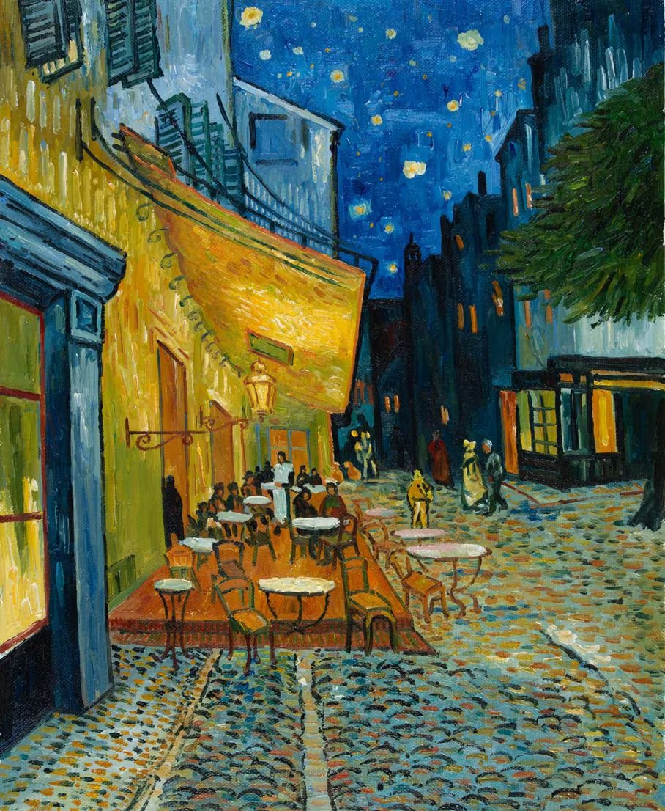 </p>

>Write a Matlab program to read this file and build the image pyramid by resize the image by a factor of 1/2, 1/4, 1/8, 1/16 and 1/32 by drop every other rows and columns.  Then display all six images as a montage of size [2 3]. 

To drop every other rows and columns in an image, you can use this Matlab syntax: (start: increment: end) to slice the matrix.  Try this Matlab command:

```
1:2:10
1:3:10
```
The first command returns the values: 1, 3, 5, 7 and 9.
The second command returns the values: 1, 4, 7, 10.

Matlab provides a proper image resizign function **_imresize(I, scale)_** where I is the input image and scale is the factor to resize.  So 0.5 means the image is reduced by a factor of 2. This function first filter the image by a lowpass filter (Gaussian) that removes the high frequency components before subsampling by skipping pixels.  This prevents aliasing and the introdduction of artifacts.

```
clear all; close all;
f = imread('assets/cafe_van_gogh.jpg');

%% Subsampling
f2  = f(1:2:end, 1:2:end, :);    % 1/2
f4  = f(1:4:end, 1:4:end, :);    % 1/4
f8  = f(1:8:end, 1:8:end, :);    % 1/8
f16 = f(1:16:end, 1:16:end, :);  % 1/16
f32 = f(1:32:end, 1:32:end, :);  % 1/32

figure(1);
montage({f, f2, f4, f8, f16, f32}, 'Size', [2 3]);
ax = gca;
ax.Position = [0.05 0.02 0.9 0.88];  % shrink axes to leave room for title
title('Naive subsampling: 1x, 1/2, 1/4, 1/8, 1/16, 1/32');

%% Resizing with imresize
r2  = imresize(f, 1/2);
r4  = imresize(f, 1/4);
r8  = imresize(f, 1/8);
r16 = imresize(f, 1/16);
r32 = imresize(f, 1/32);

figure(2);
montage({f, r2, r4, r8, r16, r32}, 'Size', [2 3]);
ax = gca;
ax.Position = [0.05 0.02 0.9 0.88];  % shrink axes to leave room for title
title('imresize: 1x, 1/2, 1/4, 1/8, 1/16, 1/32');

%% Side-by-side comparison at 1/8 scale 
figure(3);
montage({f8, r8}, 'Size', [1 2]);
ax = gca;
ax.Position = [0.05 0.02 0.9 0.88];  % shrink axes to leave room for title
title('1/8 scale — Subsampling (left) vs imresize (right)');
```

<p align="center"> 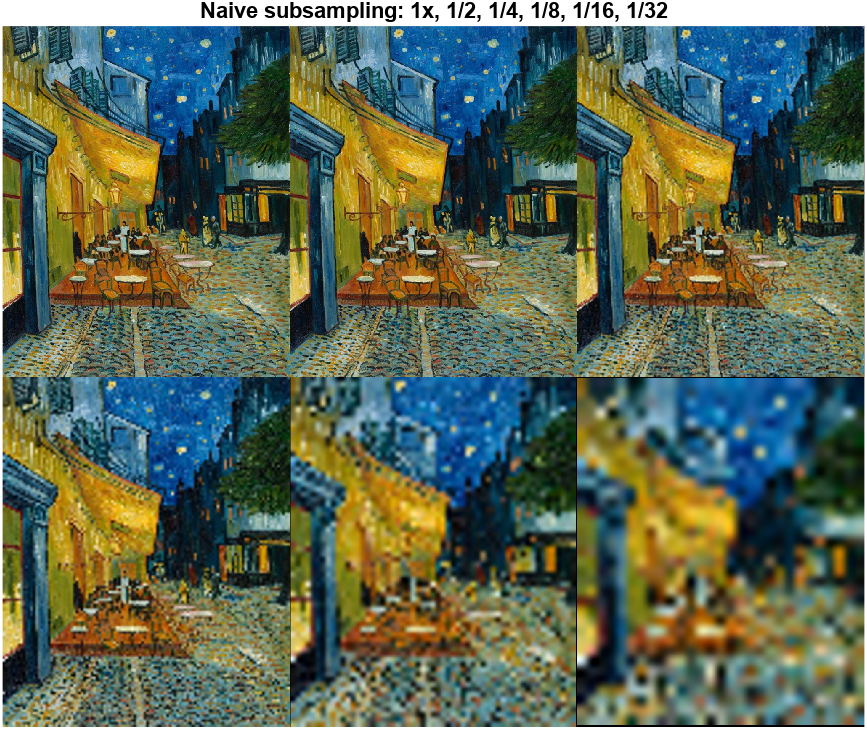 </p>

>Repeat the above exercise by adding code to properly resize the image with the **_imresize_** function.

<p align="center"> 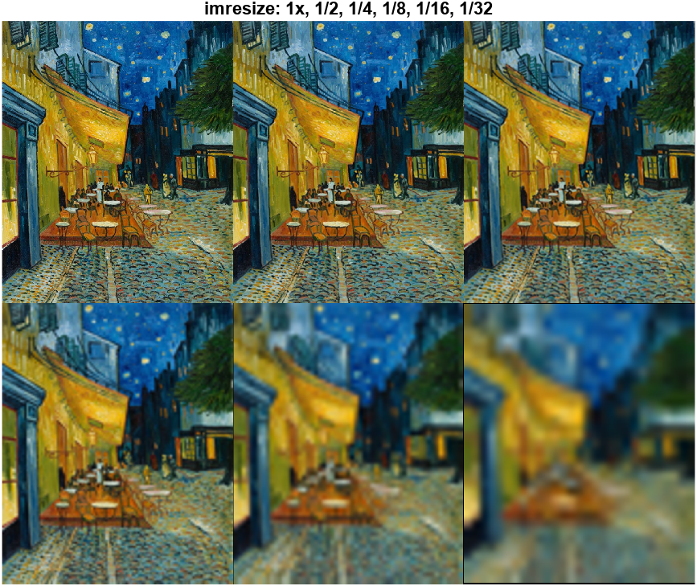 </p>

Compare the results from the two approach to subsampling.

<p align="center"> 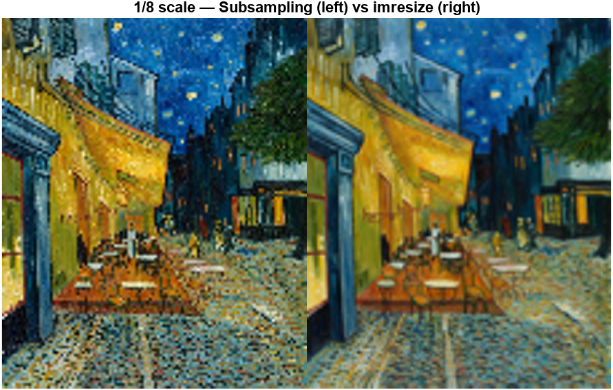 </p>

Note: while the subsampling technique produces a sharper result, the imresize version is more recognisable at lower resolutions even if it is blurry

## Task 2: Pattern Matching with Normalized Cross Correlation

In this task, we will examine how to use Matlab's normalized cross correlation (NCC) function **_normxcorr2( )_** to match a template in file **_'assets/template1.tif'_** to that of the image **_'salvador_grayscale.tif'_**.

The following code will compute the NCC function and plot it as a 3D plot:

```
clear all; close all;
f = imread('assets/salvador_grayscale.tif');
w = imread('assets/template1.tif');
c = normxcorr2(w, f);
figure(1)
surf(c)
shading interp
```

>Try this code and explore the NCC plot between the template and the image.  You should be able manually locate the position of the template from the plot. This will be the location where the normalized cross correlation value = 1.0, i.e. an exact match.

<p align="center"> 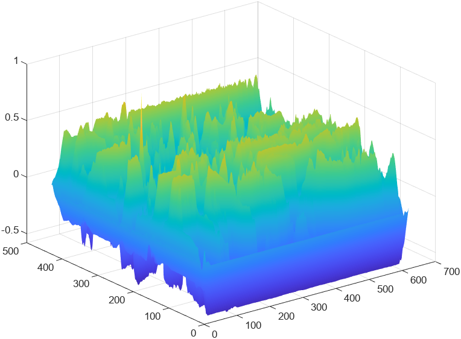 </p>


Now we want to detect the peak location automatically. This is achieve with:

```
[ypeak, xpeak] = find(c==max(c(:)));
yoffSet = ypeak-size(w,1);
xoffSet = xpeak-size(w,2);
figure(2)
imshow(f)
drawrectangle(gca,'Position', ...
    [xoffSet,yoffSet,size(w,2),size(w,1)], 'FaceAlpha',0);
```

<p align="center"> 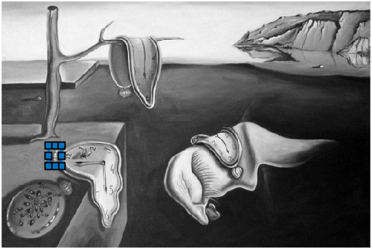 </p>


>Find out for yourself what the Matlab function **_find( )_** does.  Comment on the results.

The find function locates the indicies of array elements what meet a specified condition. In this case the specified condition is the peak of the correlation surface to give a position of best match.

>Test this procedure again with the second template image **_'template2.tif'_**.

<p align="center"> 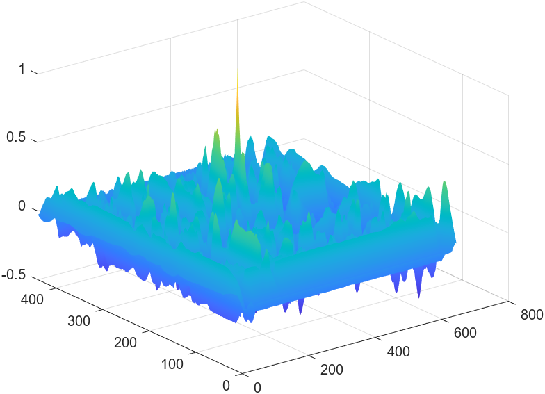 </p>

<p align="center"> 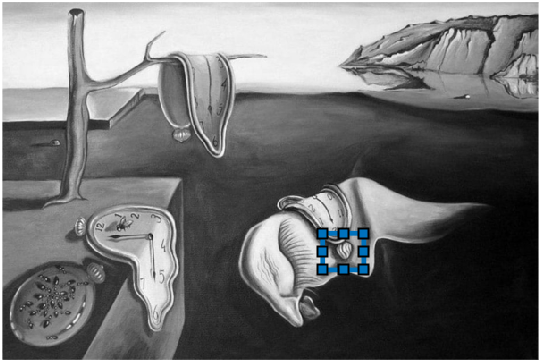 </p>


It is clear that NCC can only match a template to an image if the match is exact or nearly exact.

## Task 3: SIFT Feature Detection

Let us now try to apply the SIFT detector provided by Matlab through the function **_detectSIFTFeastures( )_** on the Dali painting that we used in task 1.

```
clear all; close all;
I = imread('assets/salvador.jpg');
f = im2gray(I);
points = detectSIFTFeatures(f);
figure(1); imshow(I);
hold on;
plot(points.selectStrongest(100));
```

<p align="center"> 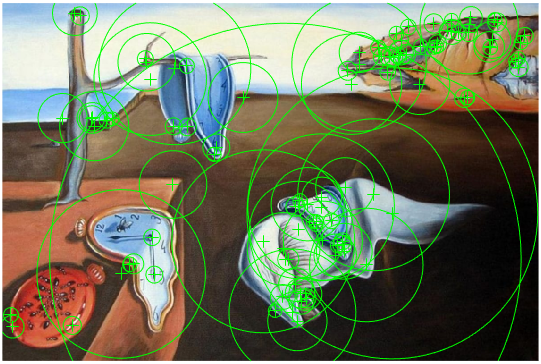 </p>

>Comment on the results.

Scale-Invariant Feature Transform (SIFT) algorithm is used to find local features in an image. These are features that can be found again even if the image is transformed. They are points that are distinctive or repeatable. The size of the circle surrounding the points in our image represent the detail of the structure and what scale it was fould at. 

>Explore and explain the contents of the data structure *_points_*.

You may want to consult this [Matlab page](https://uk.mathworks.com/help/vision/ref/siftpoints.html) about SIFT Interesting Points.

The points data structure consists of:

Location: a matrix of pixel coordinates for each keypoint. This is where the feature is in the image.

Scale: the characteristic scale at which the feature was detected. Displayed as the radius of the circle in the plot. Larger circles mean the feature was found at a coarser scale and corresponds to a larger image structure.

Orientation: the dominant gradient direction at the keypoint. Displayed as the small line extending from the centre of each circle.

Metric: the strength of the keypoint. Higher values mean more distinctive features. 


>Find the SIFT points for the image **_'cafe_van_gogh.jpg'_**.

<p align="center"> 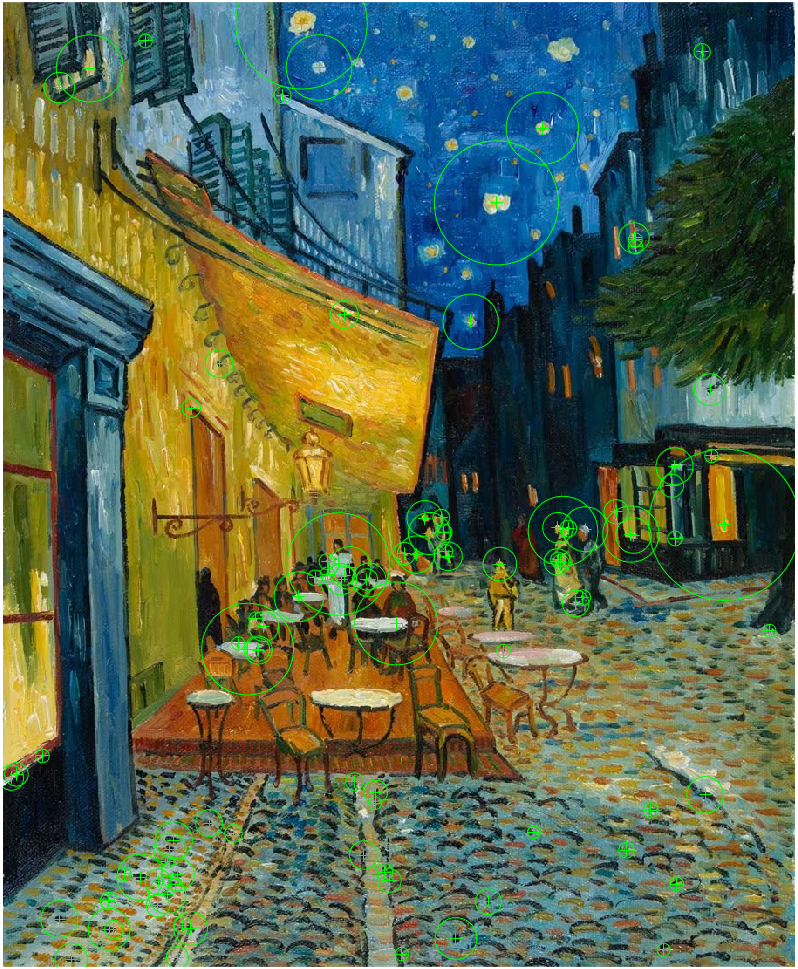 </p>

> Explore  other methods of feature detection provided by Matlab provided in their toolboxes.

```
pts_surf   = detectSURFFeatures(f);
pts_kaze   = detectKAZEFeatures(f);
pts_orb    = detectORBFeatures(f);
pts_brisk  = detectBRISKFeatures(f);
pts_harris = detectHarrisFeatures(f);
```

<p align="center"> 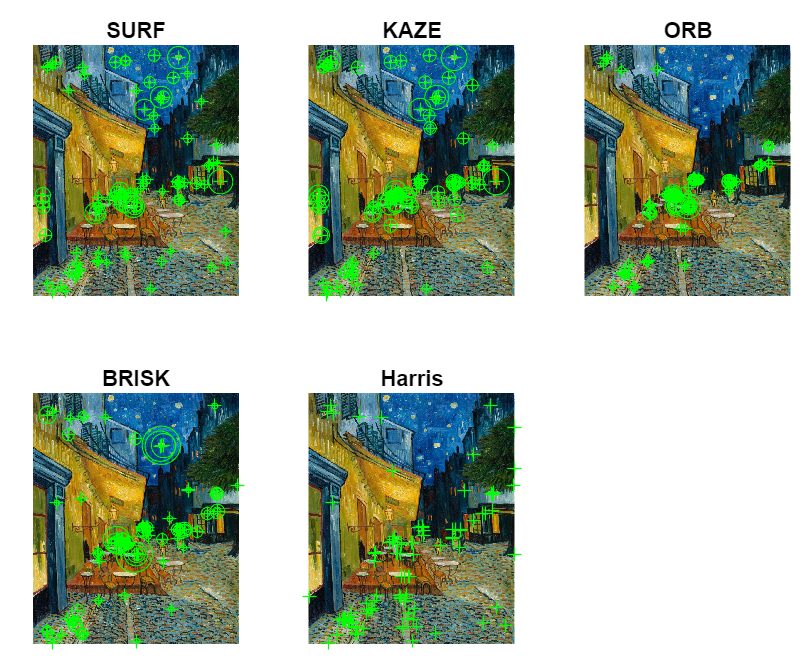 </p>

## Task 4: SIFT matching

We will now use SIFT features from two different scales of the same van Gogh painting to see how well SIFT manage to match the features that are of different scales (or sizes).

Run the following Matlab script:

```
clear all; close all;
I1 = imread('assets/cafe_van_gogh.jpg');
I2 = imresize(I1, 0.5);
f1 = im2gray(I1);
f2 = im2gray(I2);
points1 = detectSIFTFeatures(f1);
points2 = detectSIFTFeatures(f2);
Nbest = 100;
bestFeatures1 = points1.selectStrongest(Nbest);
bestFeatures2 = points2.selectStrongest(Nbest);
figure(1); imshow(I1);
hold on;
plot(bestFeatures1);
hold off;
figure(2); imshow(I2);
hold on;
plot(bestFeatures2);
hold off;
```

The code above finds the _Nbest_ features using SIFT in each iage and overlay the features as cicles onto the image.

<p align="center">  </p>
<p align="center"> 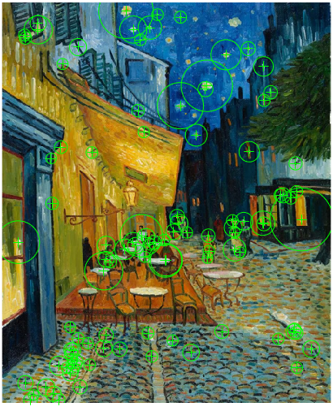 </p>

>How successful do you think SIFT has managed to detect features for these two images (one is a quarter of the size of the other)?  What conclusions can you make?

Note: The detection has done a good job at detecting most of the features on both of the images. While the scaling across both images is mostly consistant, there are some features that arnt picked up in the smaller image due to the selected strength. However overall scaling doesnt seem to affect this function too much. 

## Task 4: SIFT matching - scale and rotation invariance

The arrays *_points1_* and *_points2_* contains the interest points in the two images.  We now want to match the best *_Nbest_* points between the two sets. This is achieved as below:

```
[features1, valid_points1] = extractFeatures(f1, points1);
[features2, valid_points2] = extractFeatures(f2, points2);

 indexPairs = matchFeatures(features1, features2, 'Unique', true);

 matchedPoints1 = valid_points1(indexPairs(:,1),:);
 matchedPoints2 = valid_points2(indexPairs(:,2),:);
 figure(3);
 showMatchedFeatures(f1,f2,matchedPoints1,matchedPoints2);
```

<p align="center"> 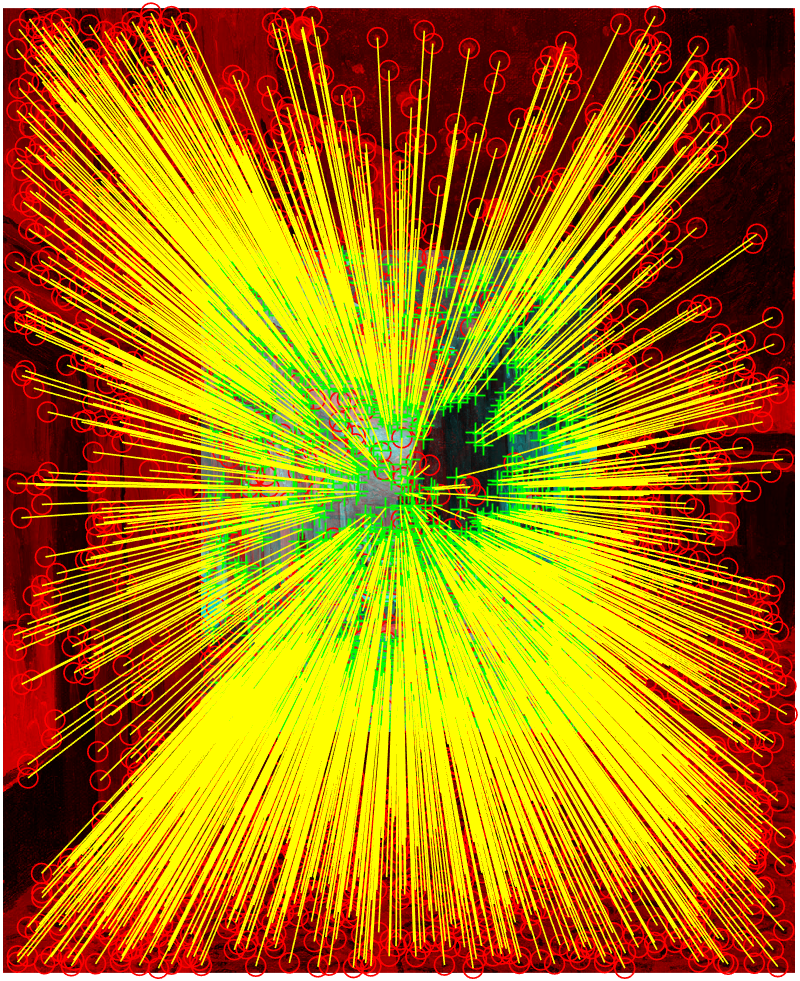 </p>

Comment on the results.

The image is filled with yellow lines which are extracting and matching all of the detected points. So much so that the image is unrecognisable

Now replace:
```
[features1, valid_points1] = extractFeatures(f1, points1);
```
with:
```
[features1, valid_points1] = extractFeatures(f1, bestFeatures1);
```
<p align="center"> 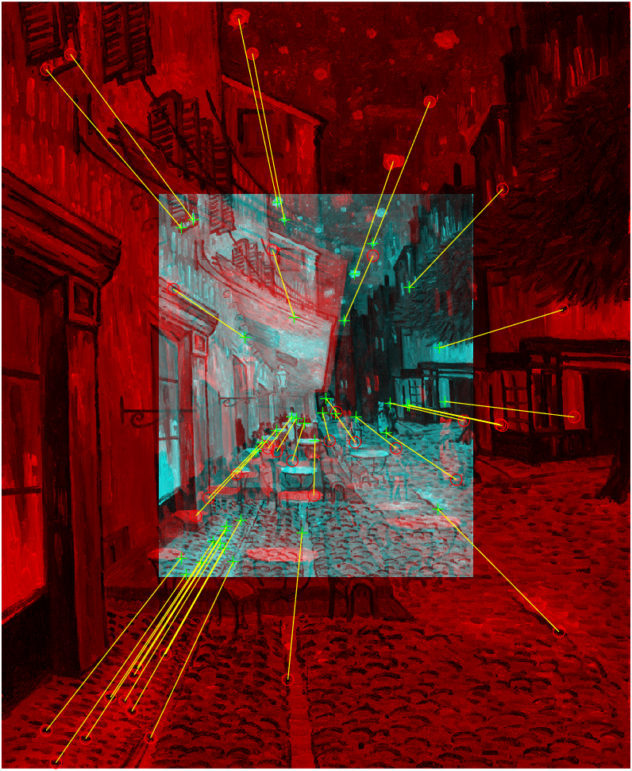 </p>

Comment on the results.

Now the image has far less yellow lines cluttering the image and we can now see the visable features that are being extracted. These are the features with the most unique descriptors. They are being matched to the surrounding larger image with consistant scaling. 

>Next, rotate the smaller image by 20 degrees using the Matlab function **_imrotate( )_** and show that indeed SIFT is rotation invariant.

```
I2_rot = imrotate(I2, 20);
f2_rot = im2gray(I2_rot);

points2_rot = detectSIFTFeatures(f2_rot);
[features2_rot, valid_points2_rot] = extractFeatures(f2_rot, points2_rot);
[features1_best, valid_points1_best] = extractFeatures(f1, bestFeatures1);

indexPairs_rot = matchFeatures(features1_best, features2_rot, 'Unique', true);
matchedPts1 = valid_points1_best(indexPairs_rot(:,1), :);
matchedPts2 = valid_points2_rot(indexPairs_rot(:,2), :);

figure;
showMatchedFeatures(f1, f2_rot, matchedPts1, matchedPts2);
title('20° rotation');
```

<p align="center"> 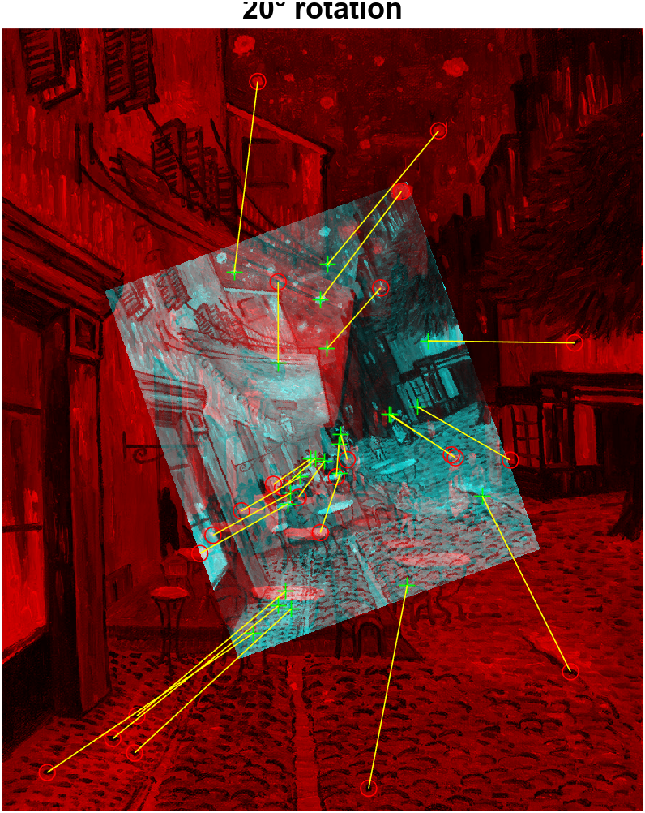 </p>

## Task 5: SIFT vs SURF

In addition to SIFT, there are other subsequently developed methods to detect features. These include:
* SURF
* KAZE
* BRISK
and others.  You will find these methods listed [here](https://uk.mathworks.com/help/vision/ug/local-feature-detection-and-extraction.html).

Let us now try to match two images from a video sequence of motorway traffic wtih cars moving bewteen frames.  The two still images are stored as *_'traffic_1.jpg'_* and *_'traffic_2.jpg'_*.  

>Use the same program in Task 4 to find the matching points between these two frames using SIFT.   Comment on the results.

<p align="center">  </p>

Notes: SIFT has poor performance as it struggles to match features between the images, especially the cars, it mostly detects static objects such as the road markings.

>Now change the algorithm from SIFT to SURF, and see what the differences in the results.

<p align="center"> 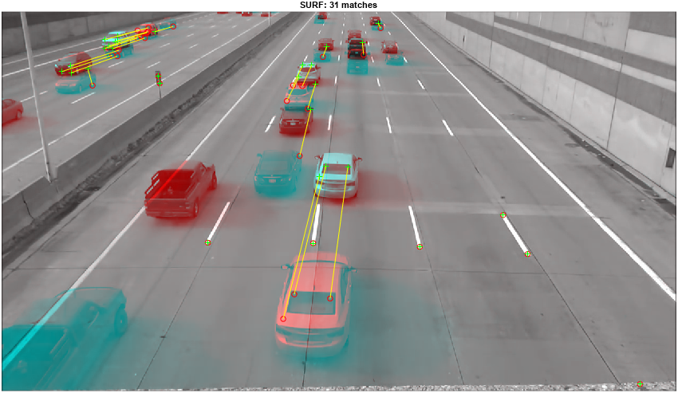 </p>

Notes: SURF performs much better, being able to detect points that have moved between the images such as with the cars.

What you have just done is to apply SIFT and SURF feature detection to perform object tracking between successive frames in a video.

```
clear all; close all;
I1 = imread('assets/traffic_1.jpg');
I2 = imread('assets/traffic_2.jpg');
f1 = im2gray(I1);
f2 = im2gray(I2);
Nbest = 100;

%% SIFT matching
points1 = detectSIFTFeatures(f1);
points2 = detectSIFTFeatures(f2);
bestFeatures1 = points1.selectStrongest(Nbest);
bestFeatures2 = points2.selectStrongest(Nbest);

[features1, valid_points1] = extractFeatures(f1, bestFeatures1);
[features2, valid_points2] = extractFeatures(f2, bestFeatures2);
indexPairs = matchFeatures(features1, features2, 'Unique', true);
matchedPoints1 = valid_points1(indexPairs(:,1),:);
matchedPoints2 = valid_points2(indexPairs(:,2),:);
figure(1);
showMatchedFeatures(f1, f2, matchedPoints1, matchedPoints2);
title(sprintf('SIFT: %d matches', size(indexPairs, 1)));

%% SURF 
points1 = detectSURFFeatures(f1);
points2 = detectSURFFeatures(f2);
bestFeatures1 = points1.selectStrongest(Nbest);
bestFeatures2 = points2.selectStrongest(Nbest);

[features1, valid_points1] = extractFeatures(f1, bestFeatures1);
[features2, valid_points2] = extractFeatures(f2, bestFeatures2);
indexPairs = matchFeatures(features1, features2, 'Unique', true);
matchedPoints1 = valid_points1(indexPairs(:,1),:);
matchedPoints2 = valid_points2(indexPairs(:,2),:);
figure(2);
showMatchedFeatures(f1, f2, matchedPoints1, matchedPoints2);
title(sprintf('SURF: %d matches', size(indexPairs, 1)));
```


## Task 6: Image recognition using neural networks

This task requires you to install a number of packages on Matlab beyond what you already have on your system.  You will be using either your laptop camera or, if you use an iPhone, use the camera on the iPhone.  For this task, you will need to install the camera support package for your machine (either Mac or PC).  You will also need to install the specific neural network model (e.g. AlexNet) onto your machines.

Enter the following:
```
% Lab 6 Task 6 
% Object recognition using webcam and various neural network models

camera = webcam;                            % create camera object for webcam
net = google;                               % change this for other networks
inputSize = net.Layers(1).InputSize(1:2);   % find neural network input size
figure 
I = snapshot(camera);      
image(I);
f = imresize(I, inputSize);                 % resize image to match network
tic;                                        % mark start time
[label, score] = classify(net,f);           % classify f with neural network net
toc                                         % report elapsed time
title({char(label), num2str(max(score),2)}); % label object
```

> Use the webcam to try to recognize different objects.  Also try to find the accuracy and speed of recogniture for different networks.


### Googlenet:
<p align="center"> 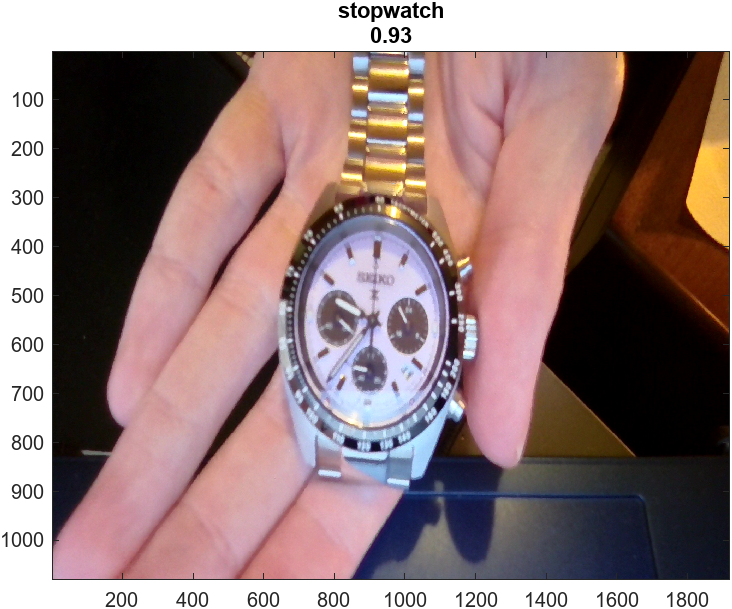 </p>

### Densenet:
<p align="center"> 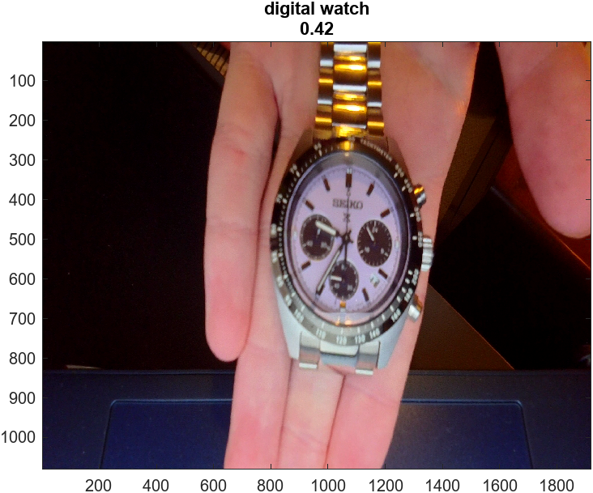 </p>

Note: Even though the googlenet Neural Network has a depth of 22 and 7 million parameters, it was more confident in recognising the wrist watch than densenet201 which has a depth of 201 and 20 million parameters. This suggests that the google network could have been trained on images which are more similar to the wrist watch than densenets dataset.  

> Modify this code so that you capture and recognize object in a continous loop.

```
clear all; close all;
camera = webcam;
net = googlenet;
inputSize = net.Layers(1).InputSize(1:2);

fig = figure;
while ishandle(fig)              
    I = snapshot(camera);
    f = imresize(I, inputSize);
    
    tic;
    [label, score] = classify(net, f);
    elapsed = toc;
    
    image(I);
    title({char(label), ...
           sprintf('Score: %.2f  |  FPS: %.1f', max(score), 1/elapsed)}, ...
           'FontSize', 14);
    drawnow;                                % force display update
end
clear camera;                               % release webcam
```

You may also want to read and explore these online documents that accompany Matlab:

[Deep learning in Matlab](https://uk.mathworks.com/help/deeplearning/ug/deep-learning-in-matlab.html)

[Pretrained CNN](https://uk.mathworks.com/help/deeplearning/ug/pretrained-convolutional-neural-networks.html)
